# Rainfall Forecasting with BiLSTM and Grid Search

[](https://www.python.org/)
[](https://www.tensorflow.org/)
[](BiLSTM_Rainfall_Prediction.ipynb)
[](LICENSE)

This project predicts daily rainfall using a Bidirectional Long Short-Term Memory (BiLSTM) neural network. It includes
exploratory data analysis, data cleaning, time-series sequence generation,
normalization, hyperparameter search, model evaluation, and prediction plotting.

For each prediction, the workflow uses a 7-day window of past weather variables
and past rainfall values to predict the next day's 24-hour rainfall. The model
does not use future information when building an input sequence.

The main focus is the rainfall prediction task. BiLSTM is the modeling method,
while preprocessing and sequence generation support the end-to-end prediction
workflow.

## Project Highlights

This project demonstrates:

- End-to-end daily rainfall forecasting workflow, from raw weather data to
  model output.
- Multivariate time-series preprocessing using past weather variables and past
  rainfall values.
- Configurable sliding-window sequence generation for next-day rainfall
  prediction. The default run uses 7 previous days.
- Configurable stacked BiLSTM regression model with focused hyperparameter tuning.
- Normalized MAAPE (%) as the main metric for rainfall data with many zero
  values.
- Supporting MAAPE, MAE, and RMSE metrics.
- Actual-vs-predicted CSV output and visualization for result inspection.

## Workflow Alignment

The notebook follows a compact analytical workflow aligned with common
industry process models:

- [CRISP-DM from IBM](https://www.ibm.com/docs/en/spss-modeler/saas?topic=dm-crisp-help-overview):
  data understanding, data preparation, modeling, evaluation, and deployment
  planning.
- [SEMMA from SAS](https://documentation.sas.com/doc/en/emref/15.3/n061bzurmej4j3n1jnj8bbjjm1a2.htm):
  sample, explore, modify, model, and assess.
- [Modern ML lifecycle guidance from Microsoft/Azure Databricks](https://learn.microsoft.com/en-us/azure/databricks/machine-learning/concepts/ml-lifecycle):
  data preparation, feature processing, model training, evaluation, and
  reproducibility artifacts.

For this repository, raw data audit, preprocessing, validation, and EDA are
kept as separate stages. The notebook first checks the raw dataset, fixes the
identified data-quality issues, validates the cleaned result, and then analyzes
the validated data before feature construction and modeling. The repository is
intended as a reproducible forecasting workflow, not a production MLOps system.

## Files

| File | Description |
|---|---|
| `BiLSTM_Rainfall_Prediction.ipynb` | Step-by-step notebook version of the workflow |
| `train_bilstm_rainfall.py` | Python script for preprocessing, training, evaluation, and output generation |
| `sample_weather_data.csv` | Synthetic sample dataset used by default for public demo/testing |
| `requirements.txt` | Python dependencies |
| `LICENSE` | MIT License for the project code and included synthetic sample data |

## Notebook and Python Script Roles

The notebook is the main file to read and run. It is organized like a research
workflow: configure the experiment, inspect the raw data, preprocess it,
validate the cleaned dataset, run EDA, train the model, evaluate the result,
and export the outputs.

The Python script acts as the backend for reusable functions. It keeps data
preparation, sequence generation, scaling, training, evaluation, and output
writing consistent without making the notebook too crowded. For normal
experiments, change the configuration cell in the notebook first; edit the
script only when changing the underlying workflow logic.

## Data Availability

The original private run used weather observations provided with permission by BMKG Maritim Tanjung Perak in Surabaya City. The observations represent the BMKG Trunojoyo observation area in Sumenep Regency.

A synthetic sample dataset, `sample_weather_data.csv`, is included so this
project can be downloaded and run without access to private raw data. The sample
file follows the same column structure as the private/local dataset used during
development, but its weather values are synthetic.

By default, the notebook uses the included synthetic sample file:

```python
data=Path("sample_weather_data.csv")
```

To run another dataset with the same column structure, place the CSV file in the
project folder and update the notebook configuration cell:

```python
data=Path("your_weather_data.csv")
```

The Python script also defaults to the included synthetic sample file. From the
terminal, pass a file explicitly for another dataset:

```powershell
python train_bilstm_rainfall.py --data your_weather_data.csv
```

Private raw dataset filename patterns such as `export-FKLIM-*.csv` are
intentionally ignored by Git so private datasets are not committed accidentally.
This protection applies to Git commands. When using GitHub's browser uploader,
do not manually select a private `export-FKLIM-*.csv` file.

## Data Dictionary

The expected dataset columns are listed below in the notebook display/model
order:

| Column | Description |
|---|---|
| `DATA TIMESTAMP` | Observation date and time |
| `TEMPERATURE AVG C` | Average air temperature in Celsius |
| `SUNSHINE 24H H` | 24-hour sunshine duration in hours |
| `REL HUMIDITY AVG PC` | Average relative humidity in percent |
| `WIND SPEED 24H MEAN MS` | 24-hour mean wind speed in meters per second |
| `RAINFALL 24H MM` | 24-hour rainfall in millimeters; also used as the prediction target |

For readability, notebook dataset tables display columns as date first, input
weather variables next, and the rainfall target `RAINFALL 24H MM` as the last
column. The same order is used in lagged feature tables: X weather variables
first, historical rainfall last.

## Experiment Scope

The repository is set up as a runnable reference experiment, not as a locked
one-off report. The default run uses a sample dataset, a 7-day lag window, an
80:20 chronological train-test split, and the included hyperparameter grid. The
same workflow can be reused for follow-up experiments by changing selected
settings in the notebook configuration cell.

The setup keeps the project reproducible while still leaving room to test
reasonable alternatives.

### Configurable from the Notebook

Open the notebook and edit the configuration cell near the top:

```python
args = Namespace(
    data=Path("sample_weather_data.csv"),
    date_col=DEFAULT_DATE_COL,
    target_col=DEFAULT_TARGET_COL,
    lag=7,
    train_ratio=0.80,
    units=[32, 64, 128],
    batch_sizes=[16, 32, 64],
    lr_drop_periods=[10, 20, 25],
    bilstm_layers=3,
    epochs=100,
    lr_drop_factor=0.1,
    initial_learning_rate=None,
    optimizer="adam",
    loss_function="mse",
    seed=42,
    cpu_threads=-1,
    verbose=0,
    output_dir=Path("outputs"),
    keep_runs=1,
    show_plot=False,
    zero_codes=[8888.0, 9999.0],
    include_target_history=True,
    prepare_only=False,
)
```

The configuration is separated into practical experiment controls:

| Group | Settings | Purpose |
|---|---|---|
| Data setup | `data`, `date_col`, `target_col` | Select the CSV file and identify the time and rainfall target columns. |
| Forecast design | `lag`, `train_ratio` | Control the look-back window and chronological train-test split. |
| Grid-search hyperparameters | `units`, `batch_sizes`, `lr_drop_periods` | Define the BiLSTM settings tested across combinations. |
| Fixed training settings | `bilstm_layers`, `epochs`, `lr_drop_factor`, `initial_learning_rate`, `optimizer`, `loss_function` | Apply the same architecture/training setup to every grid-search run. |
| Reproducibility and compute | `seed`, `cpu_threads` | Control repeatability and TensorFlow CPU parallelism. |
| Workflow and data rules | `zero_codes`, `include_target_history`, `prepare_only` | Set special missing-value codes, include past rainfall among model inputs, or stop after data preparation. |
| Output controls | `verbose`, `output_dir`, `keep_runs`, `show_plot` | Control progress messages, output location, retained runs, and interactive plot display. |
| Plot settings | Local `plot_cfg = Namespace(...)` or `settings=Namespace(...)` inside plotting cells | Keep each plot's size, DPI, line width, and grid setting close to the plot it affects. |

### BiLSTM Hyperparameters and Manual-Check Notes

The tuned BiLSTM hyperparameters in this project are `units`, `batch_size`, and learning-rate drop period. The notebook names are plural (`units`, `batch_sizes`, `lr_drop_periods`) because each one stores the values tested by the grid search.

| Setting | Library or workflow meaning | Manual-check relevance |
|---|---|---|
| `units` | Keras LSTM `units`: the number of hidden units inside each stacked LSTM layer before the bidirectional wrapper combines directions. | Useful to document model capacity, but not practical for hand-calculating the full neural network because trained weights are learned through backpropagation. |
| `batch_sizes` | Training batch size passed to Keras model fitting. | Affects optimization behavior, not the mathematical prediction formula after training. |
| `lr_drop_periods` | Project-level learning-rate schedule interval implemented with a Keras callback. | This mirrors the common learning-rate-drop workflow used in some tools, but it is not a native LSTM layer parameter. |
| `bilstm_layers` | Number of stacked Bidirectional LSTM layers used by every grid-search run. | Architecture depth is visible for documentation, but trained recurrent weights are still learned numerically. |
| `epochs` | Maximum number of passes through the training data. | Kept fixed so the learning-rate schedule has enough training steps to take effect. |
| `lr_drop_factor` | Multiplier applied when the learning rate is dropped. | Scheduler setting, not a BiLSTM architecture parameter. |
| `optimizer`, `loss_function` | Keras training choices used for all runs. | Kept constant so the grid search focuses only on the selected hyperparameters. |

The notebook exposes the BiLSTM settings that are reasonable to experiment with, but the fitted recurrent weights are learned numerically by TensorFlow/Keras and are not intended for full hand calculation.

### Core Workflow Choices

These parts define the current workflow. They can still be changed, but doing so changes the experiment design and usually belongs in the Python functions, not only in the notebook configuration cell:

- Model architecture: `Input -> Bidirectional(LSTM, return_sequences=True) -> Bidirectional(LSTM, return_sequences=True) -> Bidirectional(LSTM) -> Dense(1)`.
- Main selection metric: chronological-holdout Normalized MAAPE (%).
- Supporting metrics: MAAPE, MAE, and RMSE.
- Target scaling and prediction denormalization.
- Negative rainfall prediction clipping to `0`.
- Missing-value rules for this dataset.
- Min-Max normalization fitted from the training set.
- Feature construction using numeric weather variables plus historical rainfall.

In short, the notebook configuration cell is meant for dataset, lag, split, CPU threads, grid-search experiments, BiLSTM layer count, and general BiLSTM training settings. Plot appearance is kept inside each plotting cell. Deeper changes such as a different layer type, normalization method, preprocessing rule, or metric formula belong in `train_bilstm_rainfall.py`.


## CPU Runtime

The BiLSTM workflow runs on CPU. With `cpu_threads=-1`, TensorFlow receives
every logical CPU thread for each model fit. Grid combinations remain
sequential so one TensorFlow model owns the thread pool instead of several
models oversubscribing it. oneDNN CPU kernels are enabled before TensorFlow is
imported, and the training arrays use `float32` in memory.

Use `--cpu-threads -1` to retain all logical CPU threads or set a positive
integer to cap TensorFlow CPU parallelism. The notebook displays a compact
compute runtime report containing the processor and effective thread settings.

The included data and model fit comfortably in memory. Disk-backed or
out-of-core loading would add unnecessary overhead at this scale.

Known non-critical TensorFlow runtime log noise is reduced in code. Important
errors such as missing TensorFlow, invalid configuration, or failed training are
still allowed to appear.

## Workflow

1. Define the workflow configuration and selected dataset.
2. Load the selected weather dataset.
3. Audit the raw dataset to inspect size, date range, missing values, special codes, duplicate dates, and rainfall balance.
4. Apply preprocessing rules: chronological sorting, duplicate-date handling, X-variable interpolation, and rainfall target filling.
5. Validate the cleaned dataset before feature construction.
6. Run EDA on the validated dataset to inspect rainfall behavior, input-variable behavior, seasonal patterns, extreme events, and temporal signals.
7. Build sliding-window sequences using the configured lag value.
8. Split the data chronologically using the configured train-test ratio.
9. Normalize input features using Min-Max values fitted from the training set.
10. Scale the target during training and denormalize predictions back to millimeters.
11. Clip negative rainfall predictions to `0` after denormalization.
12. Train BiLSTM models with grid search.
13. Select the best hyperparameter combination using the lowest chronological-holdout Normalized MAAPE (%).
14. Save predictions, metrics, plots, model files, and run metadata.

```mermaid
flowchart LR
    A["CSV weather data"] --> B["Raw data audit"]
    B --> C["Data preprocessing"]
    C --> D["Cleaned data validation"]
    D --> E["Exploratory data analysis"]
    E --> F["Lagged sequence generation"]
    F --> G["Chronological train-test split"]
    G --> H["Normalization and target scaling"]
    H --> I["BiLSTM grid search"]
    I --> J["Best hyperparameter combination"]
    J --> K["Metrics, CSV outputs, and plot"]
```



## Exploratory Data Analysis

The notebook separates raw-data checks, cleaned-data validation, and EDA so each
stage has a clear purpose.

The raw data audit checks the selected CSV before values are changed. It shows:

- Raw dataset overview: row count, column count, date range, duplicate dates,
  and number of numeric columns.
- Full raw dataset table using source-like decimal formatting, with the
  rainfall target displayed as the last column.
- Missing-value counts and percentages.
- Counts of special values such as `8888` and `9999`.
- Rainfall balance: missing rainfall days, zero-rainfall days, positive-rainfall
  days, valid positive rainfall days, and valid rainfall summary values.

Preprocessing then handles the issues found in the raw check: special codes in
input variables are treated as missing and interpolated, special codes in
rainfall are filled with `0`, missing rainfall is filled with `0`, duplicate
dates are removed, and the data is sorted chronologically.

Cleaned data validation verifies the modeling dataset before lag construction.
It shows remaining missing values, remaining special codes, duplicate dates,
expected daily date gaps, rainfall range, zero/positive rainfall counts, numeric
summary, and the prepared dataset table.

EDA is then performed on the validated dataset:

- Rainfall time-series plot. Spikes indicate heavier rainfall days, while flat
  zero periods indicate no recorded rainfall.
- Combined time-series subplot for input weather variables. The rainfall target
  is excluded from this subplot because it already has its own rainfall
  time-series plot.
- Rainfall distribution plot. This shows whether the data is dominated by
  zero/low-rainfall days or contains many high-rainfall events.
- Feature correlation matrix and heatmap. These show linear relationships
  between variables; they do not prove causation.
- Calendar-month rainfall distribution table and boxplot. These show whether
  rainfall behavior differs by month, which helps inspect seasonal rainfall
  patterns.
- Extreme rainfall summary and event table. These identify rare heavy-rainfall
  days that may be harder for a forecasting model to predict.
- Rainfall autocorrelation by lag. This checks whether past rainfall contains
  temporal signal for future rainfall.
- Lagged feature-to-target correlation. This checks whether each lagged weather
  input has a direct linear relationship with the target rainfall day.
- Train-test rainfall distribution comparison to review whether the test period is wetter, drier, or more extreme than the training period.

These EDA outputs are used to understand the dataset and to identify sensible
follow-up experiments. They do not automatically determine the final lag,
split, model architecture, or hyperparameter grid. For example, a higher
autocorrelation at another lag is a useful signal to test that lag, but the
final choice still needs to be evaluated through model training and testing.

This order prevents raw special codes such as `8888` or `9999` from distorting
the plots.

## Preprocessing Notes

The preprocessing rules follow the handling notes for this dataset:

- Missing calendar dates are inserted so every lag step represents one day.
  The inserted X values follow the same interpolation rule, while the inserted
  rainfall target follows the same zero-fill rule.
- `8888` and `9999` in input weather variables are treated as unavailable
  values, converted to missing values, and filled using linear interpolation.
- Missing values in input weather variables are also filled using linear
  interpolation.
- If an input weather column still cannot be filled after interpolation because
  it has no valid values, the workflow raises an error instead of filling X
  with `0`.
- `8888`, `9999`, and missing values in the rainfall target are filled with
  `0`, because these rainfall entries are handled as no recorded rainfall for
  this dataset.
- After filling missing values, weather columns are rounded to match the decimal
  precision rules defined in the training script.

## Model Input

The target variable is:

```text
RAINFALL 24H MM
```

The default run uses a 7-day lag window. For each sample, the configured number
of previous days is used to predict rainfall on the next day.

With the default 7-day lag and the expected weather data structure, the model
input shape is:

```text
X = (samples, 7, 5)
y = (samples, 1)
```

The five input features are:

```text
TEMPERATURE AVG C
SUNSHINE 24H H
REL HUMIDITY AVG PC
WIND SPEED 24H MEAN MS
RAINFALL 24H MM
```

The lagged feature order follows the same readable dataset order: X weather
variables first and historical rainfall last.

The notebook displays the complete supervised lagged dataset after this step,
and each completed script/notebook run saves the same table as
`lagged_dataset.csv`.

Custom datasets use the same column names so the preprocessing and model
workflow can run without code changes.

## Hyperparameter Search

The project tunes only three hyperparameters:

```python
units = [32, 64, 128]
batch_sizes = [16, 32, 64]
lr_drop_periods = [10, 20, 25]
```

`units` follows the Keras LSTM API name. `lr_drop_periods` is a project-level
learning-rate scheduler setting implemented with Keras callbacks, not a
parameter of the LSTM layer itself.

The notebook also exposes these general training settings:

```python
bilstm_layers = 3
epochs = 100
lr_drop_factor = 0.1
initial_learning_rate = None
optimizer = "adam"
loss_function = "mse"
```

These settings are configurable, but they are not part of the grid search. They
are applied consistently to every grid-search run. `optimizer="adam"`,
`loss_function="mse"`, `epochs=100`, and
`lr_drop_factor=0.1` are reference workflow choices selected from common
neural-network regression practice. `initial_learning_rate=None` keeps the
selected optimizer's default learning rate.

Total combinations:

```text
3 x 3 x 3 = 27
```

The BiLSTM architecture is intentionally compact:

```text
Input -> [Bidirectional(LSTM, return_sequences=True)] x (bilstm_layers - 1) -> Bidirectional(LSTM) -> Dense(1)
```

The LSTM and Bidirectional wrapper keep Keras defaults for settings such as
activation, recurrent activation, dropout, recurrent dropout, initializers,
and merge mode. Every BiLSTM layer except the final recurrent layer uses
`return_sequences=True` so the next recurrent layer receives a sequence input.
The training workflow does not
use early stopping, softplus output activation, or additional hidden Dense
layers. Huber loss can be selected from the notebook for a follow-up experiment,
but it is not part of the current grid-search setup.

## Metrics

The main evaluation metric is Normalized MAAPE (%):

```text
MAAPE = mean(arctan2(abs(y_true - y_pred), abs(y_true)))
Normalized MAAPE = MAAPE / (pi / 2)
Normalized MAAPE (%) = Normalized MAAPE * 100
```

MAAPE is used because rainfall data often contains many zero values, where
ordinary MAPE can become unstable. The default training loss is MSE, while the
best model is selected using the smallest chronological-holdout Normalized MAAPE (%). The loss
function can be changed from the notebook configuration cell for follow-up
experiments.

`arctan2` is used instead of `arctan(abs(error) / abs(actual))` because it
avoids manual division by the actual rainfall value. This keeps the metric
defined when the actual rainfall is `0`. When both actual and predicted rainfall
are `0`, the MAAPE contribution is `0`; when the actual rainfall is `0` but the
prediction is not `0`, the contribution becomes the maximum arctangent penalty.

The normalization step converts the original MAAPE angle from the range
`0` to `pi/2` into a more readable `0%` to `100%` scale. The original MAAPE
angle is also reported as a supporting metric, while MAE and RMSE are reported
in millimeters. Metric tables are displayed with 4 decimal places in the
notebook.

## Result Interpretation

- Lower Normalized MAAPE (%), MAAPE, MAE, and RMSE values indicate better predictive
  performance.
- The best hyperparameter combination is selected using chronological-holdout Normalized MAAPE (%), not MAE or
  RMSE. Plain MAAPE is displayed only as an additional metric.
- MAE and RMSE are reported in millimeters, so they are easier to interpret in
  the original rainfall unit.
- The selected combination can have the lowest Normalized MAAPE (%) while not
  being the best on every supporting metric. This can happen because each metric
  penalizes errors differently.
- Results produced with `sample_weather_data.csv` are intended for
  reproducible public demonstration. They are not interpreted as the
  performance of private raw data.

## Post-Processing

Rainfall is a non-negative variable, so negative model predictions are clipped
to `0` after predictions are denormalized back to millimeters. This clipping is
applied before evaluation/scoring, CSV export, and plotting.

## Limitations

- The dataset represents one observation area, so the result is not assumed to
  generalize directly to other regions without retraining or further testing.
- Rainfall data contains many zero-rainfall days and sudden high-rainfall
  events. The model may follow the general pattern better than sharp extreme
  peaks.
- The default run uses a 7-day lag window. Other lag lengths may produce
  different results and can be tested from the notebook configuration cell.
- The experiment uses a chronological train-test split without cross-validation
  or an additional holdout set, so the reported test result depends on the
  selected test period.
- The same chronological holdout is used to choose the lowest-MAAPE hyperparameter
  combination and to report its performance. It is therefore a model-selection
  result, not an untouched final generalization estimate. A later study should
  add a validation period or nested rolling evaluation when an unbiased final
  estimate is required.
- The model only uses the variables available in the CSV file. Additional
  predictors such as radar, satellite, numerical weather prediction, or broader
  climate indices may improve performance if available.
- Exact results can vary slightly across package versions and runtime
  environments, although the code sets a random seed for reproducibility.
- Linear interpolation is applied as an offline data-cleaning rule and can use
  observations on both sides of a gap. A real-time operational pipeline should
  replace it with a causal imputation rule that only uses information available
  before the forecast timestamp.

## Installation

Python 3.12 is recommended. The code requires Python 3.10 or newer.

```powershell
pip install -r requirements.txt
```

## Usage

Run the notebook:

```text
BiLSTM_Rainfall_Prediction.ipynb
```

Check preprocessing without training:

```powershell
python train_bilstm_rainfall.py --prepare-only
```

Run full training:

```powershell
python train_bilstm_rainfall.py
```

Show the final plot after training:

```powershell
python train_bilstm_rainfall.py --show-plot
```

Run a smaller grid search:

```powershell
python train_bilstm_rainfall.py --units 32 64 --batch-sizes 16 32 --lr-drop-periods 10
```

Run with different general BiLSTM training settings:

```powershell
python train_bilstm_rainfall.py --bilstm-layers 3 --epochs 50 --lr-drop-factor 0.5 --initial-learning-rate 0.001 --optimizer adam --loss-function mse
```

## Reproducibility and Runtime

- The notebook and script default to the included synthetic sample dataset, so
  the public workflow can run without private data.
- A random seed is set for reproducibility, but exact results can still vary
  slightly across package versions and runtime environments.
- Full BiLSTM grid search trains 27 model combinations, so runtime can be significant.
- Use `--prepare-only` to verify data loading and preprocessing without model
  training.
- Use the smaller grid-search command above for a faster functional check.

## Outputs

Each completed run creates an output folder under `outputs/`. By default, only
the latest completed run folder is kept.

Main output files:

| File | Description |
|---|---|
| `lagged_dataset.csv` | Complete supervised lagged dataset used for modeling |
| `hyperparameter_results.csv` | All grid-search combinations sorted by `test_normalized_maape_percent` |
| `best_bilstm_model.json` | Architecture of the selected BiLSTM model |
| `best_bilstm_model.weights.h5` | Trained weights of the selected BiLSTM model |
| `best_test_predictions.csv` | Actual vs predicted rainfall on the chronological holdout |
| `best_test_prediction_plot.png` | Actual vs predicted plot for the best model |
| `best_model_summary.csv` | Compact metric summary for the selected hyperparameter combination |
| `run_metadata.json` | Configuration, CPU runtime, feature columns, split information, and scalers |

The notebook displays two compact result tables:

1. All tested hyperparameter combinations with chronological-holdout Normalized MAAPE (%) and
   MAAPE.
2. The selected best model with the full metric summary.

```text
Best model Normalized MAAPE (%):
Best model MAAPE:
Best model RMSE:
Best model MAE:
Best hyperparameter combination:
```

Generated outputs, model artifacts, Python caches, and notebook checkpoints are
ignored by Git.

## License

This project is released under the MIT License. The license applies to the
project code and the included synthetic sample dataset. Private raw datasets are
not redistributed in this repository and are not covered as public datasets by
this license.
